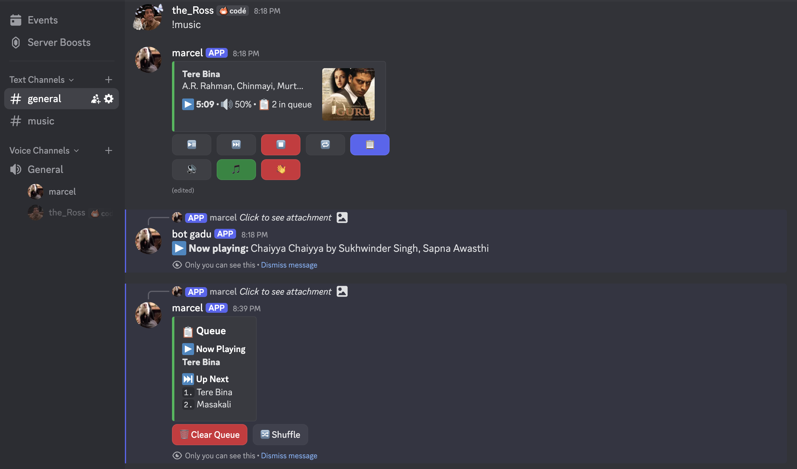

# 🤖 Discord Bot - Multi-Feature Entertainment & Utility Bot

[](https://github.com/Rapptz/discord.py)
[](https://python.org)
[](LICENSE)
[]()

> 🎵 **A powerful, modular Discord bot with interactive music player, entertainment commands, and utility features!**

---

## 🌟 **Features Overview**

| Category | Features | Status |
|----------|----------|---------|
| 🎵 **Music** | Interactive Player, Queue Management, Spotify Integration | ✅ Active |
| 🎉 **Entertainment** | Games, Memes, Fun Commands | ✅ Active |
| 🔍 **Search** | Web Search, Topic Research | ✅ Active |
| 🛠️ **Utility** | User Management, Server Stats | ✅ Active |
| 🔒 **Moderation** | Auto-moderation, Logging | ✅ Active |

---

## 🎵 **Music System - The Star Feature**

### **Interactive Spotify-Style Music Player**


*Screenshot of the interactive music player with queue management*

Our music system provides a **premium Discord music experience** with:

#### **🎶 Hybrid Music Integration: Spotify + YouTube**

Our music system combines the **best of both platforms** for an optimal experience:

**🎵 Spotify Integration (Metadata & Discovery):**
- **Rich Metadata** - Song titles, artists, album art, duration
- **High-Quality Thumbnails** - Beautiful album artwork
- **Smart Search** - Spotify's powerful search algorithm
- **Artist Information** - Detailed track and artist data
- **Popularity Metrics** - Track popularity and recommendations

**🎥 YouTube Integration (Audio Playback):**
- **High-Quality Audio** - Streams actual audio via yt-dlp
- **Reliable Playback** - Stable audio streaming
- **Wide Availability** - Most songs available on YouTube
- **Direct URL Support** - Play YouTube links directly
- **Format Optimization** - Best audio quality extraction

#### **🔄 How It Works Together:**
```
1. User searches: "Bohemian Rhapsody"
   ↓
2. Spotify API: Finds metadata, thumbnail, artist info
   ↓
3. YouTube Search: Finds matching audio using Spotify metadata
   ↓
4. yt-dlp: Extracts high-quality audio stream
   ↓
5. Discord: Plays audio with Spotify's rich information
```

#### **💫 Advanced Features**
- **Hybrid Search** - Spotify metadata + YouTube audio
- **Real-time Updates** - Live status changes with rich embeds
- **Smart Matching** - Automatically matches Spotify tracks to YouTube audio
- **Fallback System** - Falls back to YouTube-only search if Spotify fails
- **Queue Persistence** - Maintains queue across sessions with full metadata
- **Volume Memory** - Remembers volume settings per server
- **Format Selection** - Automatically selects best audio quality

### **Music Commands**

| Command | Description | Example |
|---------|-------------|---------|
| `!music` | 🎵 Launch interactive music player | `!music` |
| `!play <song>` | ▶️ Play song by name or URL | `!play Never Gonna Give You Up` |
| `!search <song>` | 🔍 Quick search and play | `!search Tere Bina` |
| `!pause` | ⏸️ Pause current song | `!pause` |
| `!resume` | ▶️ Resume paused song | `!resume` |
| `!skip` | ⏭️ Skip to next song | `!skip` |
| `!stop` | ⏹️ Stop music and clear queue | `!stop` |
| `!queue` | 📋 Show current queue | `!queue` |
| `!volume <0-100>` | 🔊 Set volume level | `!volume 75` |
| `!loop` | 🔁 Toggle loop mode | `!loop` |
| `!leave` | 👋 Leave voice channel | `!leave` |
| `!nowplaying` | 🎵 Show current song info | `!nowplaying` |

---

## 🔧 **Technical Integration Details**

### **🎵 Spotify + YouTube Workflow**

Our music system uses a sophisticated **hybrid approach** that leverages both platforms:

#### **Step-by-Step Process:**

1. **User Input Processing**
   ```python
   # User searches for a song
   query = "Tere Bina"
   ```

2. **Spotify Metadata Retrieval**
   ```python
   # Get rich metadata from Spotify
   spotify_result = spotify.search(query, type='track', limit=1)
   metadata = {
       'title': track['name'],
       'artist': track['artists'][0]['name'],
       'album': track['album']['name'],
       'thumbnail': track['album']['images'][0]['url'],
       'duration': track['duration_ms'] // 1000,
       'popularity': track['popularity']
   }
   ```

3. **YouTube Audio Search**
   ```python
   # Search YouTube using Spotify metadata for better accuracy
   youtube_query = f"{metadata['title']} {metadata['artist']}"
   youtube_url = await YTDLSource.search_youtube_for_audio(youtube_query)
   ```

4. **Audio Stream Extraction**
   ```python
   # Extract high-quality audio stream using yt-dlp
   player = await YTDLSource.from_url(youtube_url, stream=True)
   ```

5. **Discord Playback**
   ```python
   # Play audio with rich Spotify metadata display
   voice_client.play(player)
   embed = create_rich_embed(metadata)  # Beautiful Spotify-style card
   ```

#### **🛠️ Technical Stack:**

- **Spotipy** - Spotify Web API wrapper for metadata
- **yt-dlp** - YouTube audio extraction and streaming
- **discord.py** - Discord bot framework with voice support
- **asyncio** - Asynchronous processing for smooth performance
- **SQLite** - Local database for queue and settings persistence

#### **🔄 Fallback Mechanisms:**

```python
async def smart_music_search(query):
    try:
        # Primary: Spotify + YouTube hybrid
        spotify_data = await get_spotify_metadata(query)
        youtube_url = await search_youtube_with_metadata(spotify_data)
        return combine_data(spotify_data, youtube_url)
    except SpotifyException:
        # Fallback: YouTube-only search
        return await youtube_only_search(query)
    except YouTubeException:
        # Fallback: Direct URL or alternative sources
        return await fallback_search(query)
```

---

## 🚀 **Quick Start Guide**

### **1. Prerequisites**
```bash
# Required
- Python 3.8+
- Discord Bot Token
- Voice Channel Permissions

# Optional (for full features)
- Spotify API Credentials
- Google Gemini API Key
```

### **2. Installation**
```bash
# Clone the repository
git clone <your-repo-url>
cd Discord-bot-

# Create virtual environment
python3 -m venv venv
source venv/bin/activate  # On Windows: venv\Scripts\activate

# Install dependencies
pip install -r requirements.txt
```

### **3. Configuration**
Create a `.env` file in the project root:
```env
DISCORD_TOKEN=your_discord_bot_token_here
SPOTIFY_CLIENT_ID=your_spotify_client_id
SPOTIFY_CLIENT_SECRET=your_spotify_client_secret
GEMINI_API_KEY=your_gemini_api_key
```

### **4. Run the Bot**
```bash
# Activate virtual environment
source venv/bin/activate

# Start the bot
python3 main_bot.py
```

---

## 🎯 **Key Features Deep Dive**

### **🎵 Advanced Music System**
- **Hybrid Integration**: Combines Spotify's rich metadata with YouTube's audio streaming
- **Interactive UI**: Discord buttons, modals, and embeds for seamless user experience
- **Smart Queue Management**: Add, remove, shuffle, and clear songs with ease
- **Persistent Settings**: Volume and preferences saved per server
- **Real-time Updates**: Live status changes reflected instantly

### **🔍 Intelligent Search**
- **Web Integration**: Real-time web search capabilities
- **Context Awareness**: Understands natural language queries
- **Private Responses**: Use `?` prefix for private command responses

### **🛠️ Server Management**
- **Comprehensive Stats**: Detailed server analytics and member information
- **Auto-moderation**: Spam detection and content filtering
- **Logging System**: Complete audit trail of server activities
- **Permission Management**: Role-based command access control

---

## 🔧 **Configuration Options**

### **Music Settings** (`config/settings.py`)
```python
# Audio quality settings
YTDL_FORMAT_OPTIONS = {
    'format': 'bestaudio/best',
    'quality': 'highest',
    'audio_format': 'mp3'
}

# Default volume (0.0 to 1.0)
DEFAULT_VOLUME = 0.5

# Queue limits
MAX_QUEUE_SIZE = 100
```

### **Auto-Moderation Settings**
```python
# Spam detection
SPAM_THRESHOLD = 5          # Messages per time window
SPAM_TIME_WINDOW = 10       # Seconds

# Bad words filter (customize as needed)
BAD_WORDS = ['spam', 'scam', 'hack']
```

---

## 🤝 **Contributing**

We welcome contributions! Here's how you can help:

1. **Fork the repository**
2. **Create a feature branch**: `git checkout -b feature/amazing-feature`
3. **Commit your changes**: `git commit -m 'Add amazing feature'`
4. **Push to the branch**: `git push origin feature/amazing-feature`
5. **Open a Pull Request**

### **Development Setup**
```bash
# Clone your fork
git clone https://github.com/yourusername/Discord-bot-.git
cd Discord-bot-

# Set up development environment
python3 -m venv venv
source venv/bin/activate
pip install -r requirements.txt

# Run tests (if available)
python -m pytest tests/
```

---

## 🆘 **Support & Troubleshooting**

### **Common Issues**

<details>
<summary><b>🎵 Music not playing</b></summary>

**Solutions:**
1. Check bot has voice channel permissions
2. Ensure `yt-dlp` is properly installed
3. Verify Spotify API credentials (if using)
4. Check if voice channel is full
</details>

<details>
<summary><b>🔑 Bot not responding to commands</b></summary>

**Solutions:**
1. Verify bot token in `.env` file
2. Check bot has message read permissions
3. Ensure bot is online and connected
4. Check command prefix (`!` for most commands)
</details>

<details>
<summary><b>📦 Dependency installation issues</b></summary>

**Solutions:**
1. Use virtual environment: `python3 -m venv venv`
2. Upgrade pip: `pip install --upgrade pip`
3. Install with user flag: `pip install --user -r requirements.txt`
4. Check Python version (3.8+ required)
</details>

### **Need Help?**
- 📧 **Email**: [sreeshanthsoma@gmail.com]
- 💬 **Discord - username**: [sreeshu_soma]
- 🐛 **Issues**: [Issues](https://github.com/sreeshanth-soma/Discord-bot-/issues)

---

## 📊 **Statistics**


---

## 🚀 Deployment Journey: A Comedy of Errors (With a Happy Ending!)

### 😅 The Azure Adventure (aka "The 3-Hour Debugging Marathon")

After 3 hours of:
- ❌ 15+ failed container deployments
- ❌ 6 different regions tried
- ❌ Syntax errors in inline Python
- ❌ Environment variable mysteries
- ❌ "RequestDisallowedByAzure" nightmares
- ❌ Containers that start but don't connect
- ❌ Our sanity slowly disappearing

**Azure**: "Have you tried turning it off and on again?" 🤖  
**Us**: "WE'RE SWITCHING TO RAILWAY!" 🏃‍♂️💨

### 🎉 The Railway Rescue (aka "How Deployment Should Actually Work")

**Railway**: "Hi there! Want to deploy a Discord bot?"  
**Us**: "Please don't hurt us..." 😰  
**Railway**: "Just push to GitHub and add your env vars!"  
**Us**: "That's... that's it?" 🤔  
**Railway**: "Yep! *deploys in 2 minutes* ✨"  
**Us**: "...IT'S ALIVE! IT'S ACTUALLY ONLINE!" 🎊  

### 🏆 Moral of the Story:

Sometimes the simplest solution is the best solution. Railway proved that deploying a Discord bot doesn't have to involve:
- Reading 47 Azure documentation pages
- Debugging container orchestration
- Questioning your life choices
- Crying into your keyboard

**The bot is now happily running on Railway, serving Discord users.

*P.S. - If you're thinking about Azure for your Discord bot... maybe try Railway first. Your mental health will thank you.* 😄

---

<div align="center">

### **🌟 Star this repository if you found it helpful! 🌟**

**Made with ❤️ for the Discord community (and Railway for actually working!)**

[⬆️ Back to Top](#-discord-bot---multi-feature-entertainment--utility-bot)

</div>
